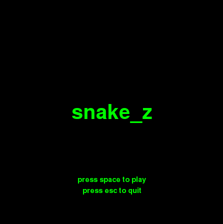
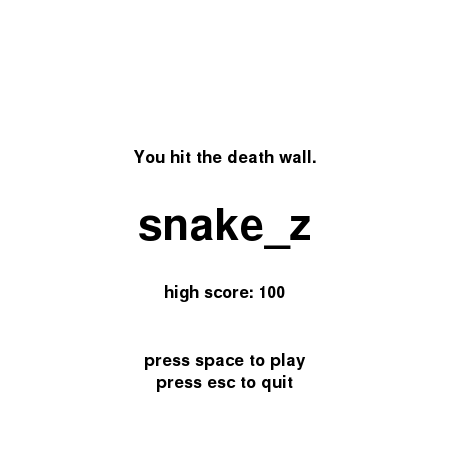

## Teach Me How to PyGame

During the event, a group of students each followed along to create a version of snake_z (black version). I created the white version before the event so we could recreate the game step by step.

  

